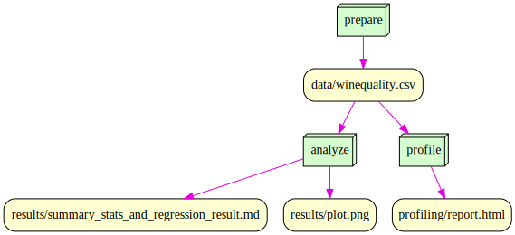

# Is477 Fall2023 Final Project

IS477-Fall2023 final project repository.

## Members:

- Jacquelin Lai (shanrou2@illinois.edu)
- Zhifeng Wang (zhifeng5@illinois.edu)

## Overview:

## Contributions:

- Jacquelin: Complete Step 6, 7, 8, 10, 14(a,b,c,f), 15, 16, 17, and 18
- Zhifeng: Complete Step 1, 2, 3, 4, 5, 9, 11, 12 13, 14(d,e,g), profreed, and Step 19 (submission)

## Analysis:

We firstly made a directory "./result" in the repositary to store the output of the analysis.py. By reading the file winequality.csv into a dataframe, we are able to classify the numpy arrays of target variable and the feature variables. Later, we split the data into training data and testing data. By using the training data, we are able to utilize it to fit the Linear Regression model. We calculated that the Mean Squared Error, Root Mean Squared Error, and R-squared, and we exported them as a text file and stored in the result file. Finally, we created a plot graph, exported it as a plot.png file, and stored it in the result file.

## Workflow:

Run step `prepare` first, and then run step `profile` and `analyze`.



## Reproducing:

To reproduce the results of this repository, you will need to first install the necessary softwares, including **Git**, **VS code**, **Docker Desktop**, and **Docker plugin for VS code**.

After you have all the necessary softwares installed, you can use

```{bash}

git clone https://github.com/zf-w/is477-fall2023-project.git

```

to clone the repository into your local machine.

Then, you can use VS code to open the directory of this repository.

In the terminal command line, you need to use the following command to pull the Docker Image, which contains the computation-environmental information of this repository, to your local machine:

```{bash}
docker pull zugz0wang/is477-fall2023:final-project
```

### Data Preparation:

Once successfully pulled down the virtual environment, you can use

```{bash}
docker run --rm -v ${PWD}:/is477 zugz0wang/is477-fall2023:final-project snakemake --cores 1 prepare
```

to complete the data preparation process.

This command will bind your local repository directory with the `/is477` directory in the virtual environment. Therefore, the downloading process will reflect on your local repository files. Suppose you don't want to open the repository directory or move into the correct directory within the Command Line terminal. In that case, you can also replace the `${pwd}` with the absolute path of the directory you cloned the repository into.

### Data Profiling:

Once successfully downloaded and merged the `wine-quality.csv`, you can use

```{bash}
docker run --rm -v ${PWD}:/is477 zugz0wang/is477-fall2023:final-project snakemake --cores 1 profile
```

to complete the data profiling process.

### Data Analysis:

Once successfully downloaded and merged the `wine-quality.csv`, you can use

```{bash}
docker run --rm -v ${PWD}:/is477 zugz0wang/is477-fall2023:final-project snakemake --cores 1 analyze
```

to complete the data analysis process.

## License:

### Repository Software License: MIT License.

You are allowed to modify, build upon the work, redistribute,
and use the software for private, public, or commercial purposes as long as you include the original license and copyright notice in your software.

### UCI Wine Quality Dataset License:

License Selection: [Creative Commons Attribution 4.0 International License](https://creativecommons.org/licenses/by/4.0/legalcode)
This work is licensed under a Creative Commons Attribution 4.0 International License. This license allows others to remix, tweak, and build upon the work, as long as they give credit and license their new creations under the identical terms.

## References:

Cortez,Paulo, Cerdeira,A., Almeida,F., Matos,T., and Reis,J.. (2009). Wine Quality. UCI Machine Learning Repository. https://doi.org/10.24432/C56S3T.
